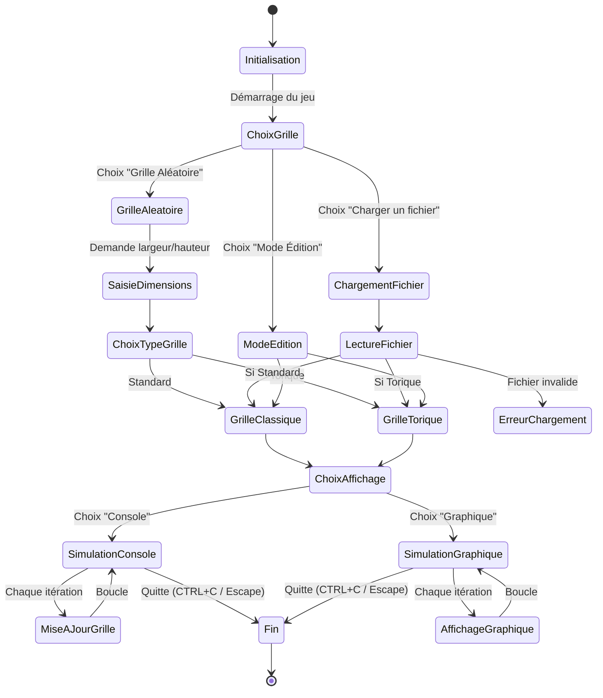

```mermaid
stateDiagram-v2
    [*] --> Initialisation

  
    Initialisation --> ChoixGrille : Démarrage du jeu
    
    ChoixGrille --> GrilleAleatoire : Choix "Grille Aléatoire"
    ChoixGrille --> ChargementFichier : Choix "Charger un fichier"
    ChoixGrille --> ModeEdition : Choix "Mode Édition"

        GrilleAleatoire --> SaisieDimensions : Demande largeur/hauteur
        SaisieDimensions --> ChoixTypeGrille
        ChoixTypeGrille --> GrilleClassique : Standard
        ChoixTypeGrille --> GrilleTorique : Torique

    ChargementFichier --> LectureFichier
    LectureFichier --> GrilleClassique : Si Standard
    LectureFichier --> GrilleTorique : Si Torique
    LectureFichier --> ErreurChargement : Fichier invalide

    ModeEdition --> GrilleClassique
    ModeEdition --> GrilleTorique

    GrilleClassique --> ChoixAffichage
    GrilleTorique --> ChoixAffichage

    ChoixAffichage --> SimulationConsole : Choix "Console"
    ChoixAffichage --> SimulationGraphique : Choix "Graphique"

    SimulationConsole --> MiseAJourGrille : Chaque itération
    MiseAJourGrille --> SimulationConsole : Boucle
    SimulationConsole --> Fin : Quitte (CTRL+C / Escape)

    SimulationGraphique --> AffichageGraphique : Chaque itération
        AffichageGraphique --> SimulationGraphique : Boucle
        SimulationGraphique --> Fin : Quitte (CTRL+C / Escape)

    Fin --> [*]
```
    
